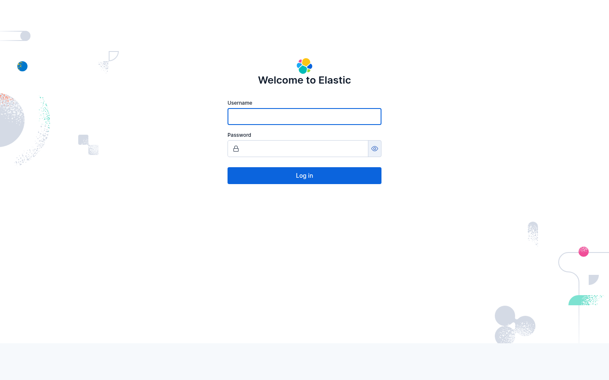

# SIEM Lab

This is a small local security lab you can run on your own computer.

It starts Elasticsearch and Kibana, sends in sample events, runs a few attack-style tests, and shows you what alerts get created.

If you are new to this stuff, that is okay. You do not need to know Elastic or SIEM tools very well before starting.



## What This Project Does

- Starts a local Elastic stack
- Loads safe sample data
- Runs a few guided attack examples
- Shows which rules create alerts
- Lets you export those alerts to a file

In simple words:

- Elasticsearch stores the lab data
- Kibana is the website you open in your browser
- A rule is the thing that says "if data looks like this, create an alert"
- A scenario is one practice example you run

## Who This Is For

- People learning how alerts work
- People testing detection rules
- Teachers making small demos or practice labs

## What You Need

Officially supported for `v0.1.0`:

- Linux
- WSL2
- macOS

Before you start, make sure you have:

- Docker with `docker compose`
- Python 3.10 or newer
- About 6-8 GB of RAM free for Docker
- Ports `9200`, `5601`, and `8080` free on your machine

Notes:

- On Linux and WSL, `./lab bootstrap` can install Docker Compose if it is missing.
- On macOS, Docker Desktop should already provide `docker compose`.

## Quick Start

### 1. Set up the lab

```bash
./lab bootstrap
```

What this does:

- Makes a local `.env` file if you do not already have one
- Creates random passwords and keys for your machine
- Creates `exports/` and `state/`
- Checks that Docker Compose works

### 2. Start Elasticsearch and Kibana

```bash
./lab up core
```

What this does:

- Starts the main lab services
- Waits for them to be ready
- Loads the built-in lab rules

Then open:

- `http://127.0.0.1:5601`

Log in with:

- Username: `elastic`
- Password: the `ELASTIC_PASSWORD` value in your local `.env`

### 3. Load safe sample data

```bash
./lab replay baseline-benign
```

What this does:

- Loads normal, low-risk sample events into the lab
- Prints a `run_id`
- Saves a small result file in `exports/`

`run_id` is just the ID for one lab run. Keep it if you want to export alerts later.

### 4. Run one attack-style example

```bash
./lab scenario run web-exploit-probe
```

What this does:

- Starts the practice web app
- Sends a few suspicious web requests
- Waits to see if the lab rules create alerts
- Prints the results and another `run_id`

### 5. Export the alerts

```bash
./lab export alerts <run-id>
```

What this does:

- Saves the alerts for that run into `exports/alerts-<run-id>.ndjson`

If you want a slower step-by-step version, read [docs/quickstart.md](docs/quickstart.md).

## Main Commands

```bash
./lab bootstrap
./lab up core
./lab replay baseline-benign
./lab scenario run web-bruteforce
./lab scenario stop web-bruteforce
./lab export alerts <run-id>
./lab export splunk-pack windows-encoded-command
./lab reset
```

## Install The CLI

If you want to install the command instead of running `./lab` from the repo:

```bash
python3 -m venv .venv
. .venv/bin/activate
python -m pip install -e .
siem-lab --help
```

## Included Practice Scenarios

- `baseline-benign`: normal activity that should not alert
- `false-positive-admin-login`: a login that looks suspicious but is actually allowed
- `trusted-scanner`: noisy scanner traffic that should stay suppressed
- `linux-reverse-shell`: Linux command activity that should alert
- `windows-encoded-command`: encoded PowerShell activity that should alert
- `web-bruteforce`: repeated failed logins against the practice web app
- `web-exploit-probe`: suspicious web requests with scanner fingerprints

## Learn First, Change Later

Best order:

1. Follow [docs/quickstart.md](docs/quickstart.md)
2. Look at the sample alert file in [docs/examples/web-exploit-probe-alerts.ndjson](docs/examples/web-exploit-probe-alerts.ndjson)
3. Read the example guide in [docs/examples/README.md](docs/examples/README.md)
4. Read [docs/extending.md](docs/extending.md) if you want to add your own scenario

## Safety

- Only use this on your own machine
- Do not expose it to the public internet
- Juice Shop is intentionally vulnerable, so only start it when you need it
- `./lab reset` deletes lab data and lab alerts
- Never commit your real `.env` file

## Testing

Run this from the repo root:

```bash
python3 -m unittest discover -s tests -q
```

## Troubleshooting

- If `docker compose` is missing on macOS, install or restart Docker Desktop
- If `./lab up core` is slow, give Docker more memory
- If `./lab export alerts <run-id>` gives you nothing, wait a bit and try again

## Extra Docs

- [docs/quickstart.md](docs/quickstart.md)
- [docs/extending.md](docs/extending.md)
- [docs/examples/README.md](docs/examples/README.md)
- [CONTRIBUTING.md](CONTRIBUTING.md)
- [SECURITY.md](SECURITY.md)
- [CODE_OF_CONDUCT.md](CODE_OF_CONDUCT.md)

This repo is meant to be easy to learn from. If something is confusing, that is worth fixing.
